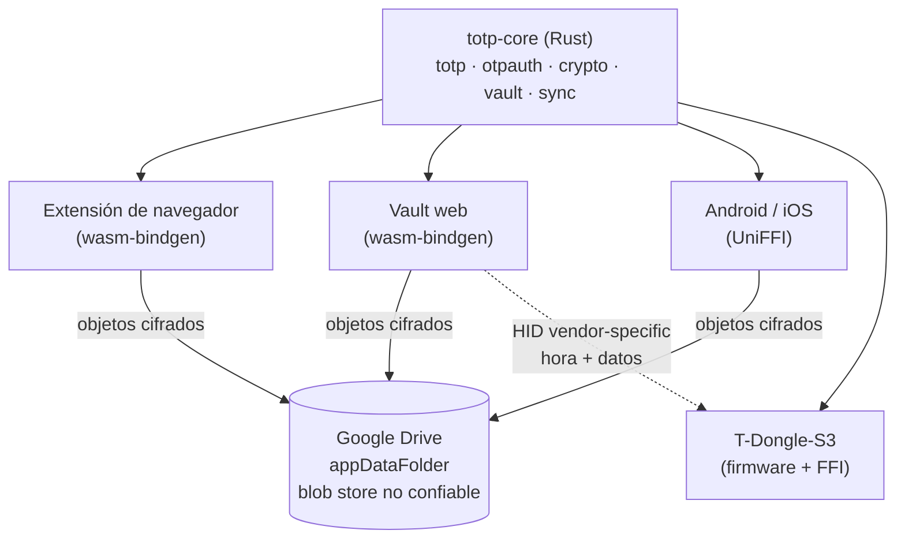

# Visión y arquitectura

## Qué se está construyendo

Un gestor de TOTP con el núcleo compartido en Rust, cifrado cliente-side y
sincronización sobre un almacén que no hace falta que sea de fiar. Los clientes
previstos: extensión de navegador, web, Android/iOS, y un dongle hardware
(T-Dongle-S3) que además hace de llave de seguridad FIDO2.

La idea que sostiene todo: **la cripto y el formato se escriben una sola vez**.
Los clientes ponen la UI, el almacenamiento y el reloj; nada que toque claves se
reimplementa por plataforma.

## Cómo encajan las piezas

El dongle no habla con Drive: recibe hora y datos por USB, típicamente desde la
web del vault, sobre una interfaz HID vendor-specific separada de la FIDO.

## Las cinco fases

1. **Vault en web + sync con Google Drive.** Valida la cripto (MK, KEK con
   Argon2id, recovery key), el formato de entrada cifrada y el modelo de sync.
   El módulo de sync se diseña desacoplado de la UI para reutilizarlo después
   como puente WebHID con el dongle.
2. **Extensión de Chrome.** Autofill de OTP en la página abierta más consulta
   desde el popup; desbloqueo con WebAuthn PRF.
3. **Dongle — parte TOTP.** Firmware propio: pantalla, navegación con un botón,
   RTC con batería, sync por vendor-HID reutilizando la web de la fase 1.
   Entregable útil por sí solo.
4. **Dongle — parte FIDO.** Integración de pico-fido vía FFI; interfaz FIDO
   siempre presente en el descriptor USB.
5. **Android / iOS.** Bindings UniFFI sobre el mismo `totp-core`, una vez
   validado el modelo en web y dongle.

## Decisiones de arquitectura ya tomadas

**El remoto es tonto a propósito.** El `appDataFolder` de Drive no puede
resolver conflictos, ni indexar, ni validar nada. Todo el trabajo de
reconciliación corre en el cliente. La ventaja: cambiar de proveedor de
almacenamiento —o hablar con el dongle— es implementar un trait de siete
métodos, no rediseñar el sync.

**`appDataFolder` no sustituye al cifrado.** Es invisible en la UI normal de
Drive, lo cual está bien, pero se trata como un blob store no confiable: la
clave nunca sale del dispositivo.

**No hay «login con Google».** La cuenta de Google solo da acceso a los bytes
cifrados. Añadir un dispositivo nuevo siempre requiere passphrase o recovery key
la primera vez.

**El core es `async` desde el principio**, aunque hoy solo corra contra memoria,
porque el backend real será `fetch`. No se piden futuros `Send`: el navegador es
monohilo y exigirlo complicaría el WASM sin ganar nada.

**pico-fido en vez de reimplementar CTAP2.1.** Ya soporta ESP32-S3,
HMAC-Secret, PIN, OATH y «Secure Lock». Reescribirlo sería meses de trabajo para
llegar a algo peor auditado.
