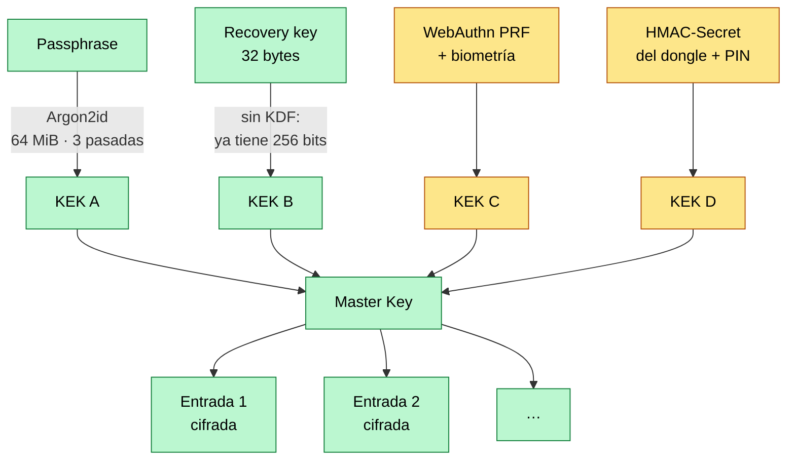
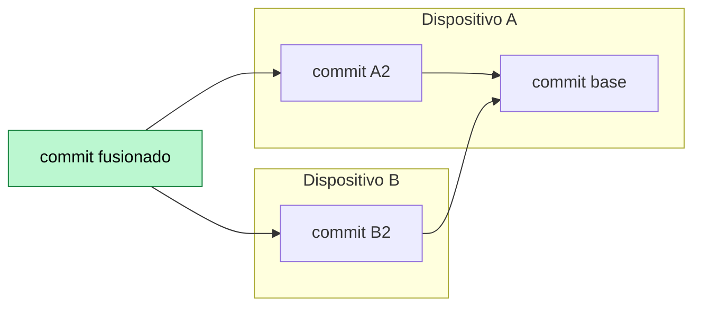

# Modelo de cifrado

Todo lo de este documento está implementado y cubierto por tests, salvo donde se
dice lo contrario.

## Primitivas

| Uso | Primitiva | Dónde |
|---|---|---|
| Cifrado de todo lo que se cifra | XChaCha20-Poly1305 (nonce de 24 bytes) | `crypto::seal` / `crypto::open` |
| Derivación de KEK desde passphrase | Argon2id v0x13 | `crypto::derive_kek` |
| Nombre de objeto en el almacén | SHA-256 sobre los bytes cifrados | `sync::ObjectId::of` |
| Códigos | HMAC-SHA1 / SHA256 / SHA512 | `totp` |

Claves de 32 bytes (`SecretKey`): se borran de memoria al soltarse, no se
imprimen en `Debug` y se comparan en tiempo constante.

Parámetros de Argon2id por defecto (`KdfParams::INTERACTIVE`): **64 MiB, 3
pasadas, 1 carril**. Por encima del mínimo que recomienda el RFC 9106 para el
perfil de segunda opción, y todavía tolerable dentro de WASM en el navegador.
Se guardan junto al envoltorio en lugar de fijarse en el código, para poder
subirlos con el tiempo sin romper vaults ya creados.

## Jerarquía de claves

Una única **Master Key** cifra las entradas. Se desenvuelve por cuatro caminos
independientes; cualquiera de ellos da la misma MK.



| Envoltorio | Mecanismo | Disponible en | Estado |
|---|---|---|---|
| A | Passphrase → Argon2id → KEK | Todos los clientes con recursos | **implementado** |
| B | Recovery key de 32 bytes | Fallback universal | **implementado** |
| C | WebAuthn PRF, con biometría en cada uso | Extensión (Chrome/Edge) | formato listo, cliente pendiente |
| D | HMAC-Secret de pico-fido + PIN | T-Dongle-S3 standalone | formato listo, firmware pendiente |

C y D comparten representación en el formato
(`WrapperKind::ExternalKey { credential }`): en ambos casos el dispositivo
resuelve 32 bytes y el vault solo guarda con qué credencial hay que volver a
pedírselos —el credential id de WebAuthn, por ejemplo—, **nunca la clave**.

La recovery key no pasa por KDF: ya tiene 256 bits de entropía propia, estirarla
no añadiría nada.

## El formato

**Cabecera** (`VaultHeader`): versión de formato (hoy `1`) y la lista de
envoltorios. No contiene ningún dato de las entradas, así que puede publicarse
tal cual en el almacén remoto.

**Entrada** (`EncryptedEntry`): issuer, cuenta, secreto, algoritmo, dígitos y
periodo, todo dentro del ciphertext. Los metadatos **no viajan en claro**: saber
que alguien tiene cuenta en un banco concreto ya es información.

**AAD en todo lo que se cifra.** El ciphertext de una entrada va atado a su
`EntryId` vía el AAD, así que renombrar o mover el objeto en el almacén remoto
invalida el MAC en vez de pasar desapercibido. En los envoltorios el AAD cubre
etiqueta, sal y parámetros del KDF: un Drive comprometido no puede bajar
`m_cost` a 8 KiB y esperar a que el cliente derive una KEK barata.

## El sync

Un control de versiones diminuto que corre entero en el cliente.



- Cada versión de una entrada es un **objeto inmutable** nombrado por el SHA-256
  de sus bytes cifrados. Editar no reescribe nada: crea un objeto nuevo. Solo
  viajan los objetos que al otro lado le falten.
- Cada cambio produce un **commit** con el árbol completo y el enlace a su
  padre. El árbol lleva el `updated_at` de cada entrada, de modo que **fusionar
  no descifra ni una sola entrada**: bastan los commits.
- Se reconcilia **fusionando por el ancestro común**. Gana el cambio más
  reciente, borrado incluido; como la historia es inmutable, lo que pierde el
  desempate sigue recuperable desde un commit anterior. Un borrado deja
  **lápida**, para que un peer desactualizado no resucite la entrada.
- El merge es **determinista**: dos clientes que fusionen las mismas dos puntas
  producen el mismo objeto byte a byte y convergen sin dar otra vuelta. Para eso
  el nonce de un commit se deriva de su propio contenido en vez de ser
  aleatorio.
- El `head` se mueve con **compare-and-set** sobre un testigo opaco (el ETag de
  Drive, el número de revisión, lo que use cada backend), y todo lo publicado se
  anota antes en un **`known-commits.log`** append-only. Perder la carrera del
  `head` no pierde el commit: sigue siendo descubrible y el siguiente sync lo
  recoge.
- Todo lo que sale del almacén se **verifica contra su hash** antes de usarse.

### El trait que lo aísla todo

```rust
pub trait ObjectStore {
    async fn contains(&self, id: &ObjectId) -> Result<bool>;
    async fn get(&self, id: &ObjectId) -> Result<Option<Vec<u8>>>;
    async fn put(&mut self, id: &ObjectId, bytes: &[u8]) -> Result<()>;
    async fn head(&self) -> Result<Option<HeadRef>>;
    async fn set_head(&mut self, expected: Option<&str>, commit: ObjectId) -> Result<HeadUpdate>;
    async fn append_known_commit(&mut self, commit: ObjectId) -> Result<()>;
    async fn known_commits(&self) -> Result<Vec<ObjectId>>;
}
```

Siete métodos. Drive es una implementación; el dongle por WebHID en la fase 3
será otra, con el mismo motor de sync por encima sin tocar. `MemoryStore` la
implementa en memoria y es con lo que corren los tests.
