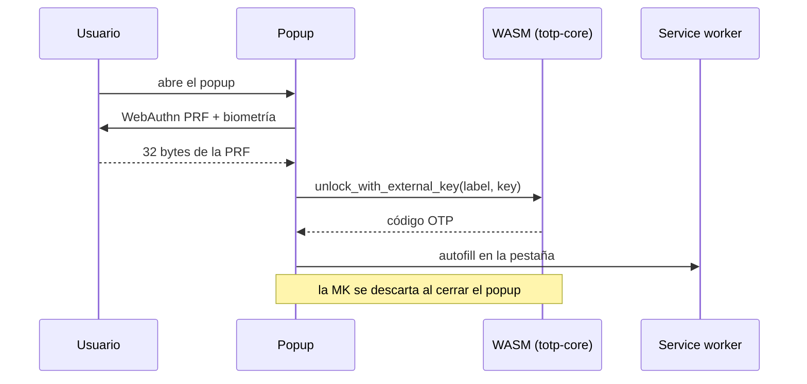

# Fase 2 — Extensión de Chrome

**Estado: sin empezar.** Depende de que la fase 1 haya validado el formato del
vault y el motor de sync.

## Objetivo

Autofill del OTP en la página abierta, más consulta de otros servicios desde el
popup, con desbloqueo por WebAuthn PRF y confirmación biométrica **en cada uso**.

## Diferencia clave con la web

La web retiene la MK en memoria mientras está desbloqueada, porque derivar
Argon2id en cada pulsación sería inviable. La extensión no: descifra bajo
demanda, con biometría cada vez, y no cachea la MK descifrada.

## Trabajo previsto

- Manifest V3 con la CSP que necesita el WASM: **`'wasm-unsafe-eval'`** para
  poder instanciarlo.
- Registro de la credencial WebAuthn con la extensión PRF y alta del envoltorio
  correspondiente vía `add_external_wrapper` — el formato ya lo soporta, no hay
  que tocar `totp-core`.
- El popup es quien dispara WebAuthn: **el service worker de MV3 no puede
  invocarlo**. Esto condiciona toda la arquitectura de la extensión.
- Autofill: detección del campo de OTP en la página y relleno.
- Sync reutilizando el mismo `ObjectStore` de Drive de la fase 1.

## Restricciones conocidas

- **Solo Chrome y Edge** tienen soporte maduro de PRF; Firefox va por detrás. El
  envoltorio A (passphrase) sigue siendo el fallback en cualquier navegador.
- Añadir la extensión como dispositivo nuevo requiere passphrase o recovery key
  la primera vez, como cualquier otro cliente.
