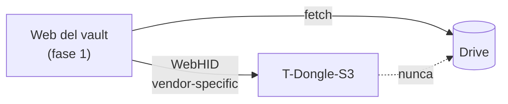

# Fase 3 — Dongle T-Dongle-S3, parte TOTP

**Estado: sin empezar.** Depende de la fase 1 (motor de sync y web que hará de
puente). **Entregable útil por sí solo**, sin depender de la parte FIDO.

## Objetivo

Firmware propio para el T-Dongle-S3: pantalla, navegación con un solo botón, RTC
con batería de respaldo, y sincronización por USB con la web del vault.

## Navegación con un solo botón

| Gesto | Efecto |
|---|---|
| Pulsación corta | Cambia de elemento (issuer + label, **sin descifrar aún**); se selecciona tras ~2 s de dwell |
| Pulsación larga | Vuelve atrás |
| Pulsación larga desde home, con petición CTAP pendiente | Confirma presencia física para completar la autenticación FIDO2 (fase 4) |

Sin petición CTAP pendiente, la pulsación larga desde home no hace nada
especial: **no hay «modo llave» activable a voluntad** ni cambio de descriptor
USB.

## Manejo de claves

Descifrado bajo demanda: se descifra solo el secreto de la entrada seleccionada,
se calcula el código, y se descarta la clave inmediatamente. Por eso la lista se
navega con issuer y label sin descifrar nada — el índice es visible, el
contenido no.

## Hora

RTC con batería de respaldo, sincronizado por USB al conectarse a un host. Evita
depender de WiFi/NTP, que en un dongle sin configuración de red no es una
opción realista.

## Canal de sync

Interfaz **HID vendor-specific**, separada de la interfaz FIDO, para poder
usarse desde una web con **WebHID**. El emparejamiento inicial también va por
USB, transfiriendo el envoltorio de la MK desde un cliente ya desbloqueado.

El dongle implementa el mismo trait `ObjectStore` de siete métodos por el otro
lado del cable: el motor de sync no se toca.

## Restricciones conocidas

WebHID solo existe en **Chrome, Edge y Opera de escritorio**. Sin soporte en
Firefox, Safari, ni móvil. Sincronizar el dongle exige uno de esos navegadores.

## Riesgo a despejar antes de diseñar

Chrome bloquea el acceso por WebHID a dispositivos FIDO. Hay que **confirmar con
un prototipo** que ese bloqueo actúa por interfaz (top-level collection) y no
por dispositivo completo. Si fuera por dispositivo, el canal de sync por WebHID
no puede convivir con la interfaz FIDO y habría que replantear la fase 3 entera.
Ver [`10-riesgos-y-puntos-abiertos.md`](10-riesgos-y-puntos-abiertos.md).
