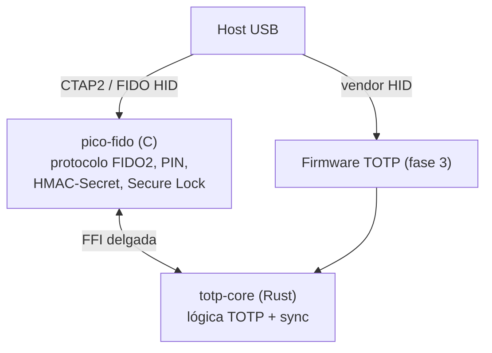

# Fase 4 — Dongle T-Dongle-S3, parte FIDO

**Estado: sin empezar.** Necesita el hardware funcionando de la fase 3.

## Objetivo

Que el mismo dongle sea también una llave de seguridad FIDO2, y que su
HMAC-Secret sirva para desbloquear el vault local (envoltorio D).

## Se reutiliza pico-fido

En vez de reimplementar CTAP2.1 desde cero. Ya soporta ESP32-S3, HMAC-Secret,
PIN, OATH y «Secure Lock» (MK protegida en la región OTP/eFuses del propio
chip). Está en C sobre mbedTLS.

## Integración: opción C, capa FFI delgada

pico-fido resuelve el protocolo FIDO2/CTAP2; el core Rust resuelve la lógica
TOTP y de sync. La frontera entre ambos es lo único que hay que escribir.

## Decisiones ya tomadas

- **La interfaz FIDO está siempre presente** en el descriptor USB. No se activa
  ni se desactiva dinámicamente: la confirmación de presencia por botón hace de
  gate de seguridad, igual que en cualquier llave FIDO2 estándar.
- **Testing del protocolo con el crate `ctap-hid-fido2`**, no con
  `authenticator-rs` — este último está pensado para embeberse en Firefox, no
  como herramienta standalone.

## Envoltorio D

El HMAC-Secret del chip, combinado con un PIN, resuelve los 32 bytes que
desenvuelven la MK sin que la clave salga nunca del dongle. El formato del vault
ya lo admite como `WrapperKind::ExternalKey`; falta el firmware que lo produzca.

Queda por definir el **mecanismo de PIN por botón** para el desbloqueo local, si
se decide no depender únicamente de la posesión física. Ver
[`10-riesgos-y-puntos-abiertos.md`](10-riesgos-y-puntos-abiertos.md).
