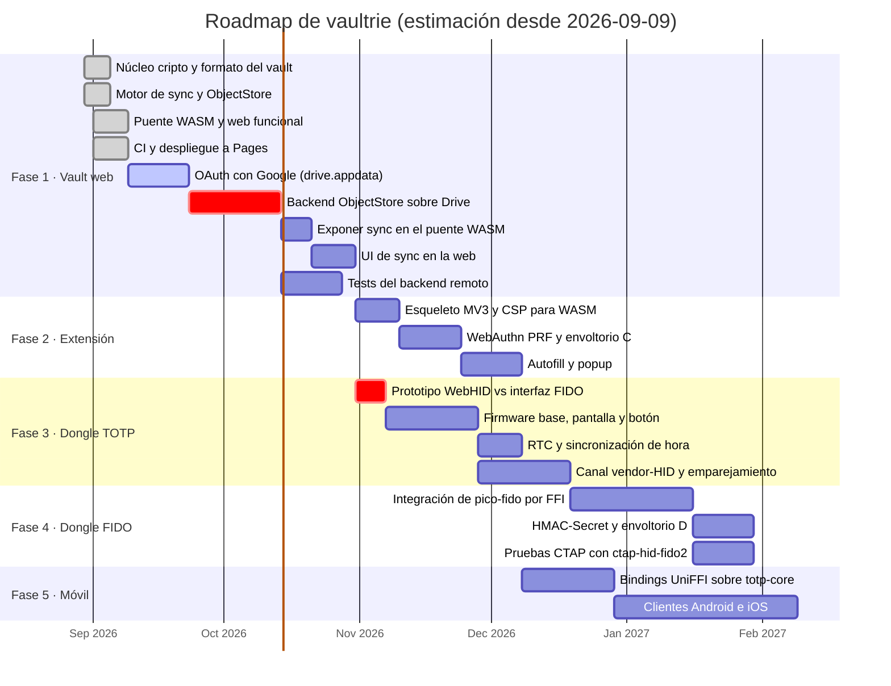
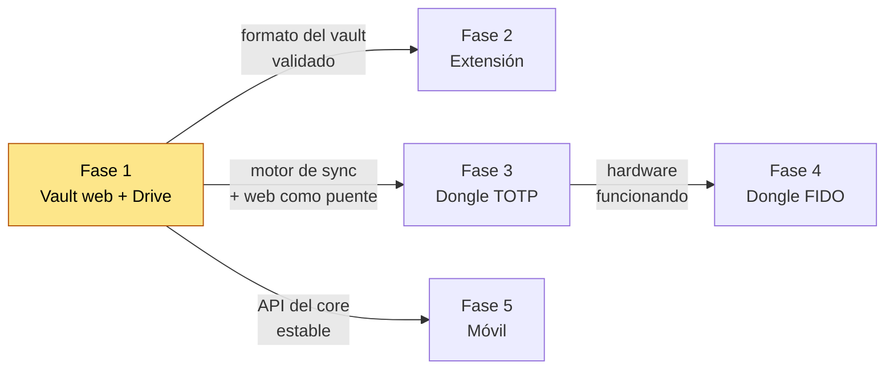

# Planificación

> **Las fechas futuras son una estimación, no un compromiso.** El repositorio no
> tiene ningún calendario acordado: lo único fechado de verdad es lo ya hecho
> (arranque el 2026-08-30, instantánea el 2026-09-09). Las duraciones de aquí en
> adelante salen del tamaño aparente de cada bloque y sirven para ver el orden y
> las dependencias, no para prometer una entrega.

## Gantt

## Camino crítico

Dos tareas marcadas como críticas, por motivos distintos:

**Backend de `ObjectStore` sobre Drive.** Bloquea el cierre de la fase 1 y, con
ella, absolutamente todo lo demás. Es además donde más incógnitas quedan: si el
compare-and-set sobre ETag no se comporta como se espera, hay que rediseñar
cómo se mueve el `head`.

**Prototipo de WebHID contra la interfaz FIDO.** Son unos pocos días de trabajo
que pueden invalidar el diseño entero del canal de sync del dongle. Va lo antes
posible dentro de la fase 3 justamente por eso: es barato de hacer y caro de
descubrir tarde.

## Dependencias entre fases

Las fases 2, 3 y 5 solo dependen de la 1, así que podrían solaparse si hubiera
manos. El Gantt de arriba las encadena porque asume un único desarrollador.

La 5 se coloca después de la 2 a propósito y no por dependencia técnica: cada
plataforma nueva congela un poco más la API del core, y conviene que la
extensión —que es la que estresa el desbloqueo con clave externa— haya
encontrado antes lo que hubiera que cambiar.

## Hitos

| Hito | Qué significa |
|---|---|
| **M1 — Fase 1 cerrada** | Dos navegadores con la misma cuenta y passphrase convergen tras editar cada uno offline, y el remoto no aprende nada del contenido |
| **M2 — Extensión usable** | Autofill funcionando con desbloqueo biométrico en cada uso, sin retener la MK |
| **M3 — Dongle standalone** | Genera códigos con su propio RTC y sincroniza por USB. Entregable útil sin nada de FIDO |
| **M4 — Llave FIDO2** | El mismo dongle pasa como autenticador CTAP2 y se autodesbloquea con HMAC-Secret |
| **M5 — Móvil** | El mismo vault, sin una línea de cripto reescrita |
