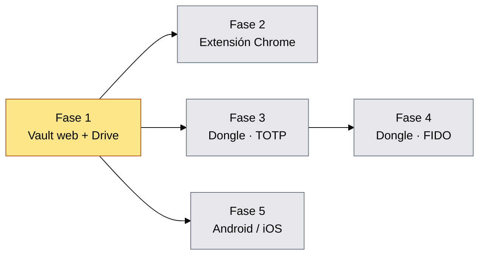

# Roadmap de vaultrie — instantánea del 2026-09-09

Desglose completo del plan y del estado real del código a día de hoy. El
[`ROADMAP.md`](../../ROADMAP.md) de la raíz es el documento vivo; esto es una
foto fechada, pensada para leerse tal cual dentro de seis meses.

## Índice

| Documento | Contenido |
|---|---|
| [`01-vision-y-arquitectura.md`](01-vision-y-arquitectura.md) | Qué se está construyendo y cómo encajan las piezas |
| [`02-modelo-de-cifrado.md`](02-modelo-de-cifrado.md) | Master Key, envoltorios, formato de entrada, modelo de sync |
| [`03-estado-actual.md`](03-estado-actual.md) | Qué hay escrito, medido y verificado hoy |
| [`04-fase-1-vault-web.md`](04-fase-1-vault-web.md) | Vault web + sync con Google Drive — **en curso** |
| [`05-fase-2-extension-chrome.md`](05-fase-2-extension-chrome.md) | Autofill y desbloqueo con WebAuthn PRF |
| [`06-fase-3-dongle-totp.md`](06-fase-3-dongle-totp.md) | T-Dongle-S3, firmware propio, canal WebHID |
| [`07-fase-4-dongle-fido.md`](07-fase-4-dongle-fido.md) | pico-fido vía FFI, llave de seguridad FIDO2 |
| [`08-fase-5-movil.md`](08-fase-5-movil.md) | Android / iOS con bindings UniFFI |
| [`09-planificacion.md`](09-planificacion.md) | Gantt en Mermaid, dependencias y camino crítico |
| [`10-riesgos-y-puntos-abiertos.md`](10-riesgos-y-puntos-abiertos.md) | Lo que puede torcer el plan y lo que falta decidir |

## Estado en una línea

Fase 1 en curso: el núcleo criptográfico y el motor de sincronización están
terminados y probados (**71 tests en verde**), la web funciona entera contra un
almacén en memoria, y falta el backend de Google Drive para cerrar la fase.

Las fases 2, 3 y 5 solo dependen de la 1: una vez validado el formato del vault
y el motor de sync, pueden ir en paralelo. La 4 necesita el hardware funcionando
de la 3.
